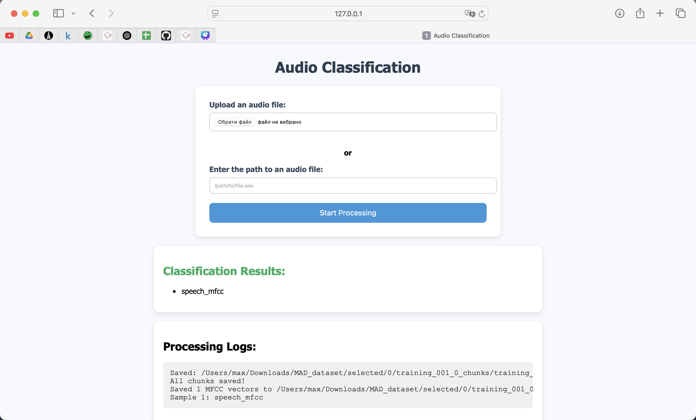

# War Targets Audio Classification

To install the requirements, run in terminal (inside the same folder):
```{bash}
pip install -r requirements.txt
```
`ffmpeg` and `ffprobe` must be installed and available in your system’s PATH.

You can install ffmpeg using:
```{bash}
# macOS (with Homebrew)
brew install ffmpeg

# Ubuntu/Debian
sudo apt install ffmpeg
```


`mp3_to_wav` python script converts an MP3 audio file into multiple WAV file chunks of a specified duration using ffmpeg. It splits audio into evenly timed chunks (default: 6 seconds). Automatically creates the output directory if it doesn't exist.

Usage
```{bash}
python mp3_to_wav.py --input path/to/input.mp3 --output path/to/output_dir --duration 6
```

| Argument     | Description                                      | Required | Default |
|--------------|--------------------------------------------------|----------|---------|
| `--input`    | Path to the input MP3 file                       | Yes      | -       |
| `--output`   | Directory to store the output WAV chunks         | Yes      | -       |
| `--duration` | Duration of each chunk in seconds                | No       | 6       |


Each WAV file will be named as:
```{}
<original_filename>_001.wav
<original_filename>_002.wav
...
```

`final_model_mfcc.py`  script processes a dataset of audio files organized in class-specific subfolders, extracts Mel-Frequency Cepstral Coefficient (MFCC) features from each `.wav` file, and saves the feature vectors (mean and standard deviation of MFCCs) into separate CSV files for each class.

- Extracts 20 MFCC coefficients from each `.wav` file
- Computes both mean and standard deviation of MFCCs per file
- Saves extracted features in class-wise CSV files
- Uses optimized NumPy operations and supports batch processing
- Designed for datasets organized into subdirectories per class

The dataset folder should be structured as follows:
```{bash}
dataset/
├── class1/
│   ├── audio1.wav
│   ├── audio2.wav
│   └── ...
├── class2/
│   ├── sample1.wav
│   ├── sample2.wav
│   └── ...
└── ...
```

Output Format: For each class (i.e., subfolder), a CSV file will be created in the specified output directory containing MFCC feature vectors:

```{bash}
output/
├── class1_mfcc.csv
├── class2_mfcc.csv
└── ...
```

Each row in a CSV file represents a .wav file and contains a 40-element feature vector:
- First 20 values: mean of the MFCCs
- Next 20 values: standard deviation of the MFCCs

Usage
```{bash}
python final_model_mfcc.py --input ./dataset --output ./features
```

Arguments

| Argument   | Description                                               | Required | Default        |
|------------|-----------------------------------------------------------|----------|----------------|
| `--input`  | Path to the dataset directory containing class subfolders | Yes      | –              |
| `--output` | Directory to store output CSV files                       | No       | Current dir (`.`) |

This project implements custom Support Vector Machine (SVM) classifier from scratch, using the One-vs-One (OvO) strategy to handle multiclass audio classification. The dataset contains pre-extracted MFCC (Mel-Frequency Cepstral Coefficient) features representing sounds of AR15 gunshots, human speech, and tanks.

- Classify audio samples into one of three classes: AR15, Speech, or Tank.
- Use custom SVM classifiers for each class pair (OvO approach).
- Train the model on MFCC features extracted from `.wav` audio files.
- Evaluate and visualize performance using classification reports and PCA.

The input data must be in the form of **CSV files**:

Each CSV file contains one row per audio sample, where each row is a feature vector (e.g., concatenation of MFCC mean and standard deviation values).

#### `final_train_model.py`
Custom Binary SVM:
-   Uses Stochastic Gradient Descent (SGD) to minimize hinge loss with L2 regularization.
-   Supports binary labels (-1 and 1).
-   Outputs both class predictions and probabilistic confidence (via sigmoid).

Multiclass OvO Strategy:

- Trains K*(K-1)/2 binary classifiers for K classes.
- Uses soft-voting based on classifier probabilities to assign final labels.
- Handles low-confidence predictions by labeling them as unknown (if max prob < 0.45).

Command-line Interface:
- Accepts any number of class-specific CSV files as positional arguments.
- Automatically assigns labels by order of CSV file.

Visualization Tools:
- Compares predicted vs. true class labels in a scatter plot.
- 3D PCA projection of the full dataset for visual inspection.

```{bash}
/opt/homebrew/bin/python3.11 /Users/max/la_pr/final_train_model.py \
  /Users/max/la_pr/dataset-ar15_mfcc.csv \
  /Users/max/la_pr/dataset-speech_mfcc.csv \
  /Users/max/la_pr/dataset-tank_mfcc.csv
```

##### MFCC Visualizer

This script generates visualizations of MFCC feature data extracted from audio files. It supports plotting the number of samples per class, PCA projections of the feature space, and Kernel Density Estimation (KDE) - based distributions of the first three MFCC coefficients.

Usage:

Run the script with one of the available plot types:

```bash
python mfcc_visualizer.py --input path/to/csv_folder --plot count
python mfcc_visualizer.py --input path/to/csv_folder --plot pca
python mfcc_visualizer.py --input path/to/csv_folder --plot mfcc
```

Each *_mfcc.csv file in the input folder should correspond to a class and contain MFCC feature vectors.

### Web Application Deployment

To facilitate easy usage of the developed audio classification pipeline without requiring command-line interaction, we designed and implemented a lightweight web application based on the **Flask** framework.

The full classification process is wrapped into a Python function `run_pipeline(filepath)`, which accepts a path to an audio file in either `.mp3` or `.wav` format.  
The processing flow inside `run_pipeline` consists of the following steps:

1. If an `.mp3` file is provided, it is automatically converted into multiple `.wav` chunks using `split_mp3_to_chunks`.
2. If a `.wav` file is provided, it is segmented directly using `split_wav_to_chunks`.
3. The resulting audio chunks are processed by the `process_flat_wav_folder` function to extract MFCC features and save them into a CSV file.
4. The MFCC feature vectors are then passed into the `predict_with_pretrained` function, which loads a pretrained SVM model and predicts the corresponding class labels for each chunk.

The web interface allows users to either:
- Upload a local audio file (`.mp3` or `.wav`),
- Or specify the path to an existing audio file on the server.

Upon submission, the backend executes `run_pipeline` and captures both the standard output (logs) and the predicted classes. The web page then displays:
- The predicted class for each audio chunk,
- Any generated logs for debugging and transparency,
- Possible errors (e.g., invalid file types or non-existent paths).

Uploaded temporary files are automatically deleted after processing to maintain server hygiene.

The server listens on all available interfaces (`0.0.0.0`) at port `5001` with `debug` mode enabled during development. A simple HTML template (`index.html`) provides the user interface.

This web-based deployment significantly improves accessibility and practical usability of the developed model, allowing users to classify battlefield audio samples easily without any programming knowledge.

---

### Web Interface Example



*Figure 1: Web interface of the audio classification application. Users can upload an audio file or specify its path, trigger the classification pipeline, and view both the classification results and processing logs.*
